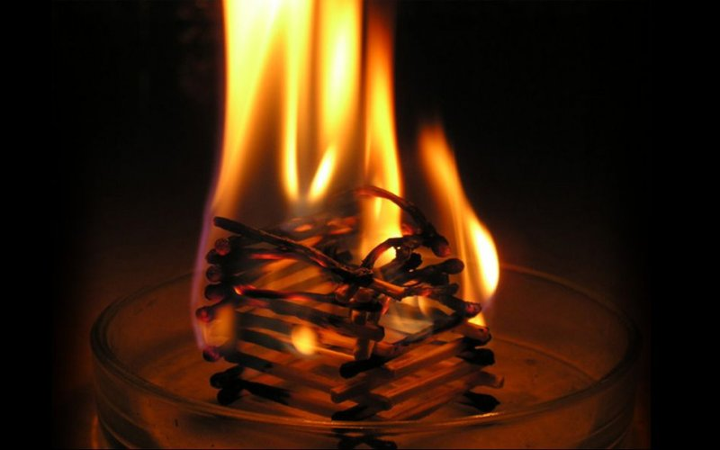
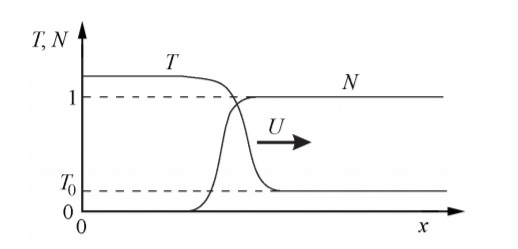
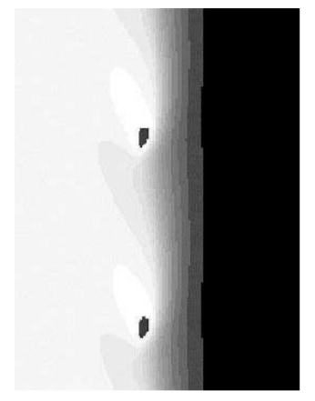

---
## Front matter
lang: ru-RU
title: Теплопроводность, детерминированное горение
author: |
	Кроз Елена, Ухарова Софья, Новикова Алина, Чупрына Петр, Попов Олег, Ширяев Кирилл \inst{1}
	
institute: |
	\inst{1}RUDN University, Moscow, Russian Federation
date: MatMod--2021, 27 Feb, 2021 Russia, Moscow

## Formatting
mainfont: PT Serif
romanfont: PT Serif
sansfont: PT Sans
monofont: PT Mono
toc: false
slide_level: 2
theme: metropolis
header-includes: 
 - \metroset{progressbar=frametitle,sectionpage=progressbar,numbering=fraction}
 - '\makeatletter'
 - '\beamer@ignorenonframefalse'
 - '\makeatother'
aspectratio: 43
section-titles: true
---

# Горение
{ #fig:001 width=70% }

## Описание задачи

Предлагается рассмотреть среду с учетом теплопроводности, в которой возможна экзотермическая химическая реакция (ХР). Численно
решая систему дифференциальных уравнений, можно исследовать различные режимы горения в одномерном и двумерном случаях.

## Простейший случай

Среда должна обладать **теплопроводностью** и возможностью протекания **экзотермической реакции**, скорость которой сильно возрастает
при увеличении температуры.

## Параметр E

E - безразмерная энергия активации, равная отношению
энергии активации к теплоте реакции.

## Режимы горения

- **Одномерный случай**: стационарный, пульсирующий(автоколебательный)

- **Двумерный случай**: стационарный, пульсирующий, спиновый

## Одномерный случай [1/2]

**Стационарный режим** - скорость распространения волны постоянна, а профили температуры и концентрации переносятся вдоль оси X не деформируясь. (рис. -@fig:002)

{ #fig:002 width=70% }

## Одномерный случай [2/2]

**Пульсирующий(автоколебательный) режим** - скорость волны переменная, и горение распространяется в виде чередующихся вспышек и угасаний.

-От значения параметра E, зависит какой режим реализуется.

## Двумерный случай

Фронт состоит из нескольких зон горения,
распространяющихся по винтовой линии
вдоль цилиндра(рис. -@fig:003)

{ #fig:003 width=70% }

## Выводы
Среда должна обладать **теплопроводностью** и возможностью протекания **экзотермической реакции**.

Режимы горения:

- **Одномерный случай**: стационарный, пульсирующий(автоколебательный)

- **Двумерный случай**: стационарный, пульсирующий, спиновый

-От значения параметра E, зависит какой режим реализуется.

