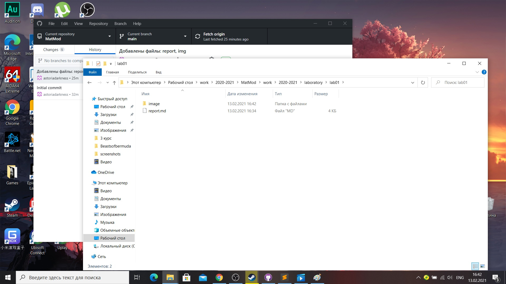
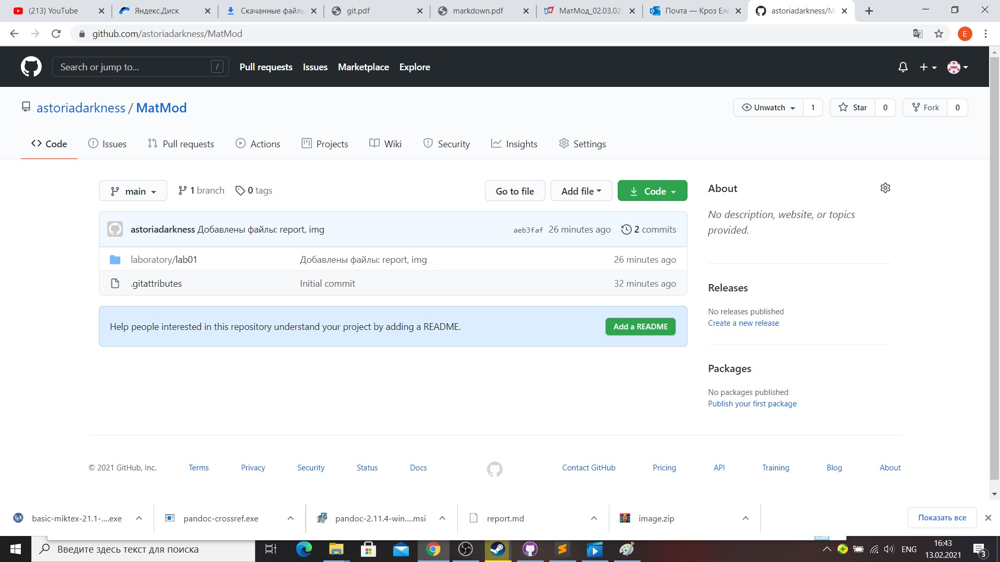

---
## Front matter
lang: ru-RU
title: Structural approach to the deep learning method
author: |
	Elena K. Kroz\inst{1}
	
institute: |
	\inst{1}RUDN University, Moscow, Russian Federation
date: MatMod--2021, 13 Feb, 2021 Russia, Moscow

## Formatting
mainfont: PT Serif
romanfont: PT Serif
sansfont: PT Sans
monofont: PT Mono
toc: false
slide_level: 2
theme: metropolis
header-includes: 
 - \metroset{progressbar=frametitle,sectionpage=progressbar,numbering=fraction}
 - '\makeatletter'
 - '\beamer@ignorenonframefalse'
 - '\makeatother'
aspectratio: 43
section-titles: true
---

# Репозиторий

## Репозиторий GitHub
Создаем репозиторий на GitHub. (рис. -@fig:001)

{ #fig:001 width=70% }

## Создание папки

Связываем репозиторий с папкой на пк (рис. -@fig:002)

{ #fig:002 width=70% }

## Загрузка файлов

Загружаем файлы в репозиторий (рис. -@fig:003)

{ #fig:003 width=70% }

## Файлы через браузер

 Проверяем файлы в репозитории через браузер (рис. -@fig:004)

{ #fig:004 width=70% }

## Файл отчета

Изменяем файл отчета под себя (рис. -@fig:005)

{ #fig:005 width=70% }

## {.standout}

Wer's nicht glaubt, bezahlt einen Taler
