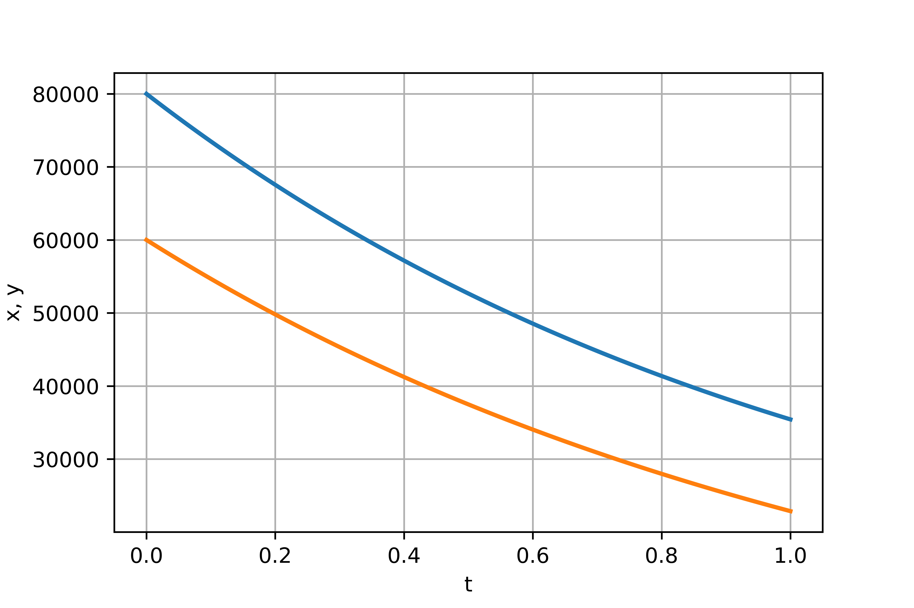

---
## Front matter
lang: ru-RU
title: Модель боевых действий
author: |
	 Кроз Елена Константиновна НФИбд-02-18\inst{1}

institute: |
	\inst{1}Российский Университет Дружбы Народов

date: МатМод--2021, 27 февраля, 2021, Москва, Россия

## Formatting
mainfont: PT Serif
romanfont: PT Serif
sansfont: PT Sans
monofont: PT Mono
toc: false
slide_level: 2
theme: metropolis
header-includes: 
 - \metroset{progressbar=frametitle,sectionpage=progressbar,numbering=fraction}
 - '\makeatletter'
 - '\beamer@ignorenonframefalse'
 - '\makeatother'
aspectratio: 43
section-titles: true

---

# Цели и задачи

## Цели лабораторной работы

Рассмотреть простейшую модель боевых действий – модели Ланчестера. 

## Задачи лабораторной работы

1. Изучить три случае модели Ланчестера.
2. Построить графики изменения численности войск для 2-х случаев.
3. Определить победившую сторону, найти условие,
при котором та или другая сторона выигрывают бой (для каждого случая).

# Процесс выполнения лабораторной работы

## Теоретический материал

В противоборстве могут принимать участие как регулярные войска,
так и партизанские отряды. В общем случае главной характеристикой соперников
являются численности сторон. Если в какой-то момент времени одна из
численностей обращается в нуль, то данная сторона считается проигравшей (при
условии, что численность другой стороны в данный момент положительна).

## Теоретический материал 

Три случая ведения боевых действий: 

1. Боевые действия между регулярными войсками
2. Боевые действия с участием регулярных войск и партизанских отрядов
3. Боевые действия между партизанскими отрядами 

## Первый случай 

Модель боевых действий между регулярными войсками:

$$
 \begin{cases}
	\frac{dx}{dt}= -a(t)x(t) - b(t)y(t) + P(t)
	\\   
	\frac{dy}{dt}= -c(t)x(t) - h(t)y(t) + Q(t)
 \end{cases}
$$

## Второй случай

Модель ведение боевых действий с участием регулярных войск и
партизанских отрядов:

$$
 \begin{cases}
	\frac{dx}{dt}= -a(t)x(t) - b(t)y(t) + P(t)
	\\   
	\frac{dy}{dt}= -c(t)x(t)y(t) - h(t)y(t) + Q(t)
 \end{cases}
$$

## Третий случай 

Модель ведение боевых действий между партизанскими отрядами с учетом предположений предыдущего случая:

$$
 \begin{cases}
	\frac{dx}{dt}= -a(t)x(t) - b(t)x(t)y(t) + P(t)
	\\   
	\frac{dy}{dt}= -h(t)y(t) - c(t)x(t)y(t) + Q(t)
 \end{cases}
$$

## Условие задачи и индивидуального варианта

Между страной $X$ и страной $Y$ идет война. Численность состава войск исчисляется от начала войны, и являются временными функциями $x(t)$ и $y(t)$
В начальный момент времени страна $X$ имеет армию численностью 80000 человек, а в распоряжении страны $Y$ армия численностью в 60000 человек.
Для упрощения модели считаем, что коэффициенты $a, b, c, h$ постоянны. 
Также считаем $P(t), Q(t)$ непрерывные функции.
Постройте графики изменения численности войск армии $X$ и армии $Y$ для следующих случаев:

## Случай 1. Модель боевых действий между регулярными войсками

$$
 \begin{cases}
	\frac{dx}{dt}= -0.21x(t) - 0.855y(t) + sin(t)+2
	\\   
	\frac{dy}{dt}= -0.455x(t) - 0.32y(t) + cos(t)+2
 \end{cases}
$$

{ #fig:003 width=60% height=60% }

## Случай 2. Модель боевых действий между регулярными войсками

$$
 \begin{cases}
	\frac{dx}{dt}= -0.267x(t) - 0.687y(t) + |sin(2t)|
	\\   
	\frac{dy}{dt}= -0.349x(t)y(t) - 0.491y(t) + 2|cos(t)|
 \end{cases}
$$

{ #fig:004 width=60% height=60% }

# Выводы по проделанной работе

## Вывод

В результате лабораторной работы я познакомились с моделью модели Ланчестера, а также
проверила, как работает модель в трех случаях и построила их графики.